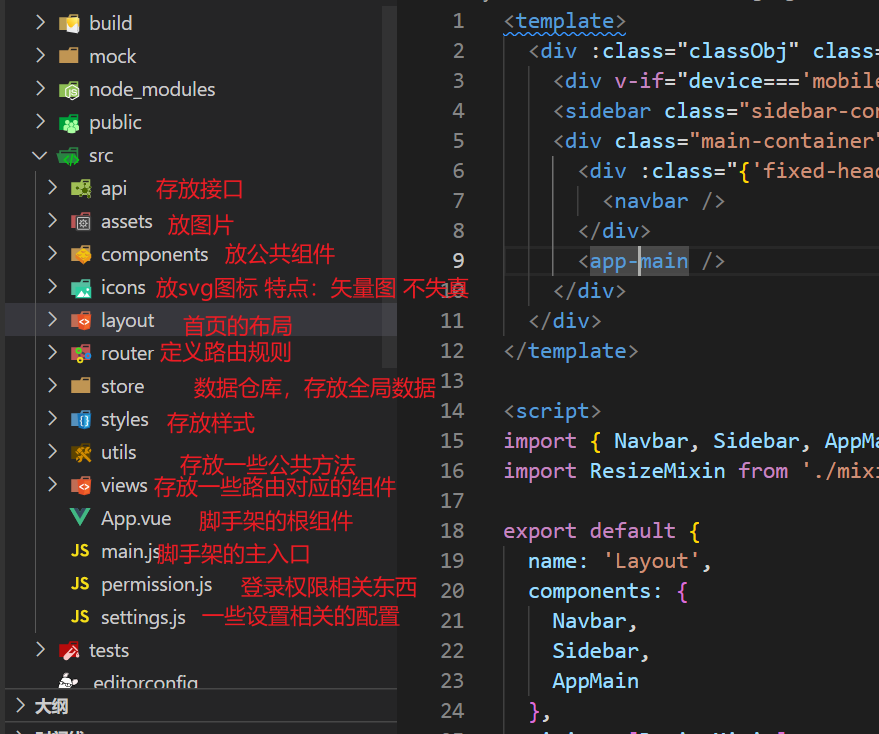

# 项目预览 - 整体设计

## 01- 项目基本预览

说明: 我们想看项目效果,  知道要做什么功能,  需要先启动预览项目

hrsaas:  人力资源后台管理系统 

项目启动
- 在线预览 

  [http://ihrm.itheima.net/#/dashboard](http://ihrm.itheima.net/#/dashboard)

  http://ihrm-java.itheima.net/#/dashboard（备用）

- 本地启动（hrsass-example）

  npm install

  npm run dev 查看 package.json

问题小结:

- 如何预览查看我们的项目?

## 02- 业务介绍

说明: 我们运行起项目, 可以大致的查阅我们需要做的功能模块

讲解内容:

- 模块介绍

  登录  主页  组织  公司  员工  **权限控制**

本节目标: 了解项目的功能模块

## 03- 权限控制 - 菜单功能演示

说明:  本项目的主要核心功能就是 **权限控制**, 不同角色登录进来, 看到的菜单效果应该不一样，能够做的操作也就不一样

讲解内容:

- 核心功能: 权限控制的演示
- RBAC的权限控制说明

问题小结:

- 本项目最核心的功能是什么?

  权限管理

- RBAC是什么?

  role  based access control  基于角色的权限控制

  给员工分配角色 给角色分配权限

# 人力资源的环境搭建

## 04- vue-element-admin的介绍

问题: 这类的系统太常见了! 一切从零开始, 效率太低!  `vue-element-admin` 是一个后台集成方案, 我们开发一般会参考开发

讲解内容:

- vue-element-admin 的基本介绍
- 完整集成方案 和 基础模板

问题小结:

- vue-element-admin 是什么?
  - 后台前端集成方案

- 我们开发是用完整的集成方案来开发么?
  - 基础模板

## 05- 基本开发环境的准备

说明: 接下来要做的是一个大型的项目，我们需要确定环境没有问题

讲解内容:

- 确定环境
  - nodejs
  
    vue脚手架
  
  - git
  
  - npm: 淘宝镜像
  
  - vscode: `eslint` 插件,  `vetur`插件

本节目标: 确定自己的环境是没有问题的

## 06- 基础模板 - 拉取代码运行

说明: 环境没有问题, 我们需要在原有的  **基础模板**  上改造开发, 所以要先拉取代码

讲解内容:

- git 拉取代码
- 安装依赖
- 启动项目

本节目标: 拉取代码, 运行项目

问题小结: 运行项目的命令是什么?

1.npm install 

2.npm run dev （查看package.json）

## 07- 基础模板 - 目录结构

说明: 本项目已经生成了一个基本的开发架子，我们下面来看看这个架子

讲解内容:

- 架子目录整体介绍

  mock文件夹: 模拟后台接口,   （mockjs 模拟接口的框架）

  tests文件夹: 做功能测试的, 写脚本的   （jest测试框架）

- **环境变量文件的介绍**  

  环境变量中变量名只能以`NODE_ENV`，`BASE_URL` 和以 `VUE_APP_` 开头

  内置了 `NODE_ENV`，`BASE_URL` 变量 

  加载方式可以通过package.json 打包命令的 --mode 参数指定

本节目标: 大致认识项目架子的整体目录

问题小结: 三个 .env 开头的文件是什么文件 ?

环境变量文件

## 08- 基础模板 - src 目录的介绍

说明: 我们开发最核心的就是 src 目录, 所以来看看 src 目录

讲解内容:

- src 目录概览

本节目标: 熟悉 src 目录

## 09- 基础模板 - 分析 main.js 

说明: src 目录下面文件虽然多, 但是最核心的就是 main.js 

讲解内容:

- 熟悉 main.js 的内容
- 删除 mock 相关的内容

问题小结: 将来拿到别人的项目源码去阅读, 第一件事情从 src 下的哪个文件开始看起 ?

main.js开始阅读

## 10- 基础模板 - 分析路由

说明: 除了main.js, 最核心的就是路由

讲解内容:

- 查看 router / index.js

  一级路由  登录

  一级路由  404

  一级路由  首页(架子layout组件)下面, 可以嵌套二级路由

- layout架子

本节目标: 熟悉整个项目的路由设计

## 11- 基础模板 - permission.js

说明: src下，除了main.js还有两个文件，**`permission.js`** 和**`settings.js`**, 我们来看看 permission.js

讲解内容:

- permission.js 文件的作用: 进行登录访问权限控制
- permission.js 文件的内容解读 - 写完之后可以参考查阅
- 删除 permission.js 的内容 - 将来自己编写

问题小结:

- src 目录下的 permission.js 文件有什么用 ?

  判断用户是否登录

## 12- 基础模板 - setting.js (了解)

说明: 除了 **`permission.js`** 还有一个 `setting.js` 文件

讲解内容:

- settings.js 文件的基本查看

问题小结:

- src目录下的 settings 的文件有什么作用 ?
- 设置页签内容
- 固定头部
- 展示侧边栏的logo

## 13- 基础模板 - vuex 目录解析

说明: 一般项目大了, 一定会分模块开发, 我们这个项目默认也进行模块的拆分

讲解内容:

- vuex 模块的查阅
- 清除 user.js 模块的内容 (将来我们自己写)

问题小结:

- 以后工作中, 如果项目大了, 我们需要对vuex分模块管理么?

## 14- 基础模板 - styles 和icons目录

说明：该项目还使用了[scss](https://www.sass.hk/)作为css的扩展语言，

在**`styles`**目录下，我们可以发现scss的相关文件

## 15- 基础模板 - git 管理项目

说明：使用 git 管理项目，进行代码备份

## 16- 基础模板- 改造request.js

说明: 这个架子对于请求模块的封装  和 我们之前的封装是类似的

讲解内容:

- 查阅 API 模块的目录
- 查阅 utils 目录 request.js 的封装, 改造成自己的模块
- 删掉request.js中的所有拦截器

## 17- 公共资源图片和样式准备

说明: 基本架子是搭完了, 为了方便学习, 我们将整个项目要用的样式和图片, 都复制过来

讲解内容:

- 复制公共样式
- 复制公共图片

问题小结:

- 拷贝公共样式 common.scss 过来, 要让样式将来生效, 应该要进行什么操作?

  ​

# 登录模块

## 18- 配置项目端口号 和 标题

说明: 在正式开发业务之前，先将项目的**本地端口**和**网站名称**进行一下调整

讲解内容:

- 配置端口

  devServer : port

- 配置网站标题

  public / index.html 的 title

本节目标: 学会配置项目的端口号 和 网站标题

## 19- 实现登录页基本布局(快速)

说明: 我们要做登录, 肯定是先写登录的布局, 我们可以在原有的结构基础之上进行改造

讲解内容:

- 基于又有的结构 - 替换成我们需要的结构

解释: 我们该项目的侧重点, 在于介绍项目的核心技术, 所以样式我们快速完成, 实际工作可以慢慢调整
